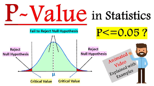

# Hypothesis Testing Interview Notes

## Questions

1. [What is hypothesis testing?](#q1)

2. [What is a P-Value?](#q2)

3. [What is the null hypothesis, and how do you determine whether to reject it?](#q3)

4. [What tests are used to get the P-value?](#q4)

5. [When would you use a t-test vs. a z-test?](#q5)

6. [What is the difference between a Type I and a Type II error?](#q6)

7. [What Is A/B Testing?](#q7)

8. [How do you handle a dataset missing several values?](#q8)

9. [How can you avoid overfitting your model?](#q9)

10. [How can you avoid underfitting your model?](#q10)

---

# Answers

---

## 1. What is hypothesis testing?

### Answer:
Hypothesis testing is a statistical method used to make decisions about a population based on sample data. It tests whether an assumption is true or false.

### Example:
iFarmer assumes that farmers who use fertilizer produce more crops. Hypothesis testing checks if this is actually true using real data.

- **Null Hypothesis (H0):** There is no effect or difference.
- **Alternative Hypothesis (Ha):** There is an effect or difference.

---

## 2. What is a P-Value?

### Answer:
A p-value measures the probability of observing results at least as extreme as the collected data, assuming the null hypothesis is true.

- **P-value < 0.05** → Significant result → Reject H0
- **P-value > 0.05** → Result may be due to chance → Fail to reject H0

---

## 3. What is the null hypothesis, and how do you determine whether to reject it?

### Answer:
The null hypothesis is the default assumption that there is no relationship or effect between variables.

### Example:
- **H0:** Soil nutrients have no effect on crop yield.
- **H1:** Soil nutrients affect crop yield.

### Decision Rule:
- If **P-value < 0.05** → Reject H0
- If **P-value > 0.05** → Fail to reject H0

---

## 4. What tests are used to get the P-value?

### Answer:

| Test | When to Use |
|---|---|
| T-test | Compare means of 2 groups |
| Z-test | Large sample size (n > 30) |
| Chi-square test | Categorical data |

---

## 5. When would you use a t-test vs. a z-test?

### Answer:

| T-test | Z-test |
|---|---|
| Small sample size (n < 30) | Large sample size (n > 30) |
| Population standard deviation unknown | Population standard deviation known |
| Example: 20 farmers | Example: 500 farmers |

---

## 6. What is the difference between a Type I and a Type II error?

### Answer:

### Type I Error (False Positive)
Rejecting the null hypothesis when it is actually true.

Example:
Concluding a new model performs better when it actually does not.

### Type II Error (False Negative)
Failing to reject the null hypothesis when it is false.

Example:
Concluding a model shows no improvement when it actually does.

---

## 7. What Is A/B Testing?

### Answer:
A/B Testing is a controlled experiment used to compare two versions of something to determine which performs better.

- Version A = Control
- Version B = Variation

The audience is randomly divided between both versions, and results are measured using statistical hypothesis testing.

### Example:
iFarmer could compare two loan application page designs to see which gets more farmer sign-ups.

---

## 8. How do you handle a dataset missing several values?

### Answer:
Common approaches include:

- Drop rows with missing values
- Drop columns with too many missing values
- Fill missing values with constants
- Replace with mean or median
- Use regression methods to estimate missing values

---

## 9. How can you avoid overfitting your model?

### Answer:
Overfitting happens when a model performs well on training data but poorly on test data.

### Ways to avoid overfitting:
- Keep the model simple
- Use cross-validation
- Train with more data
- Use data augmentation
- Apply regularization
- Use ensemble methods like bagging and boosting

---

## 10. How can you avoid underfitting your model?

### Answer:
Underfitting happens when the model is too simple to learn patterns from the data.

### Ways to avoid underfitting:
- Increase model complexity
- Add more features
- Train for more iterations
- Use a better algorithm
